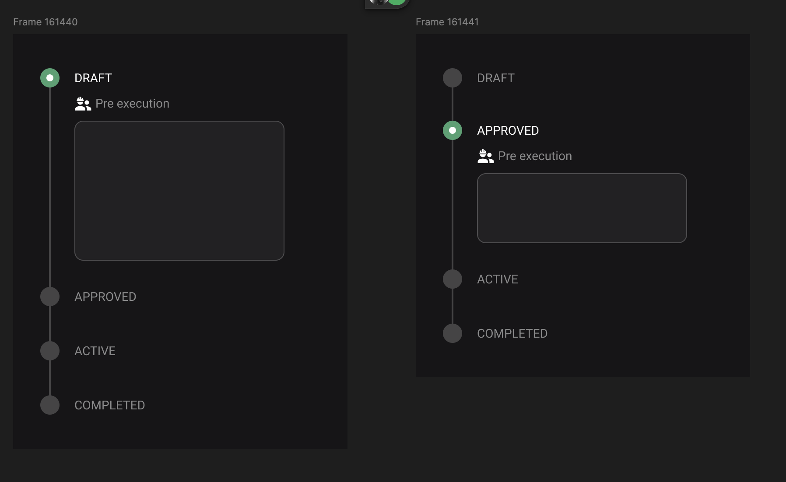
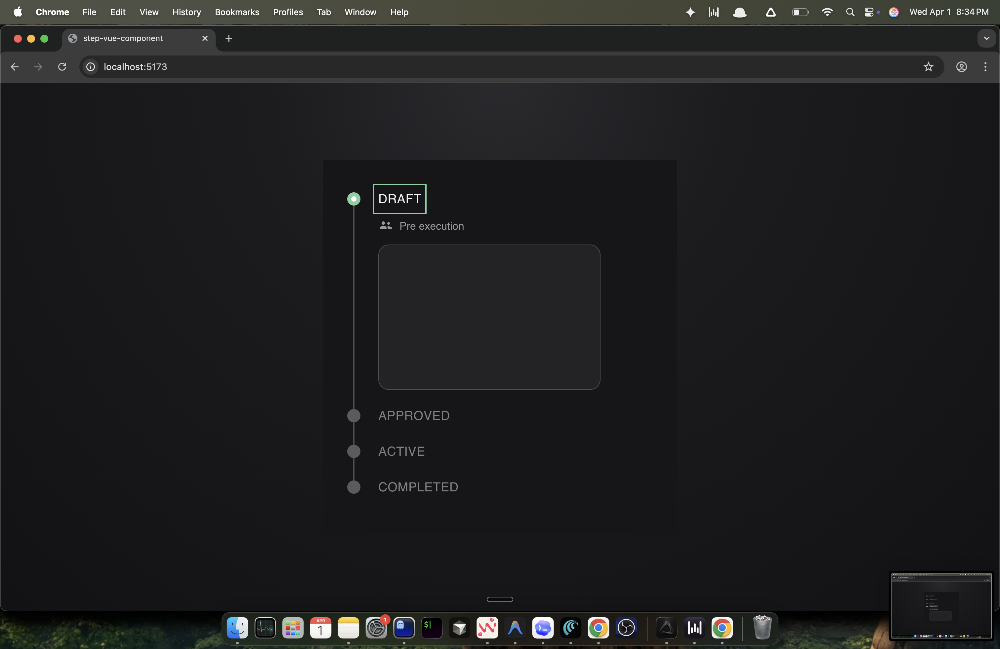
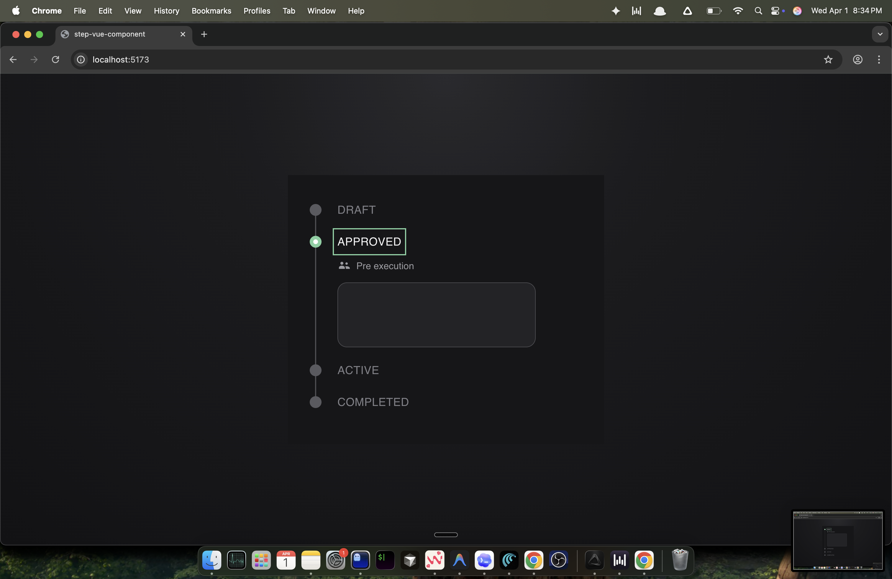
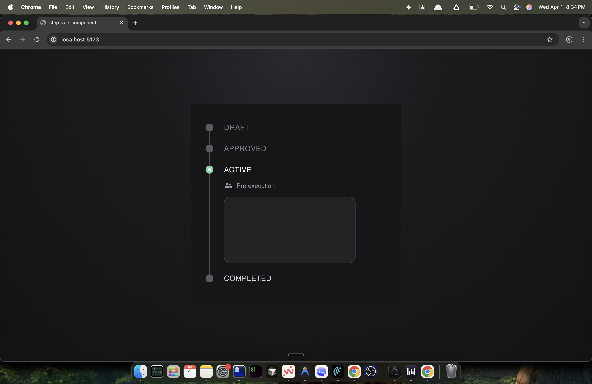
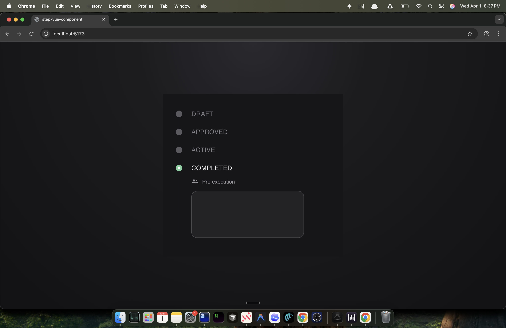

# Step Flow Component (Vue 3)

Minimal Vue 3 assignment implementation for a reusable vertical step flow component.

## Tech Stack

- Vue 3 (Vite)
- TypeScript
- SCSS
- BEM class naming
- `script setup`
- Single File Components (SFC)

## Project Setup

```bash
npm install
```

## Run Locally

```bash
npm run dev
```

Open: `http://127.0.0.1:5173` (or the port shown in terminal).

## Production Build

```bash
npm run build
```

To preview the production build locally:

```bash
npm run preview
```

## Component Behavior

- Reusable step component is implemented in `src/components/FlowStep.vue`.
- Vertical flow container/state is implemented in `src/App.vue`.
- Only one step can be active at a time.
- Clicking a step label sets it as active.
- Active step shows:
  - highlighted step marker
  - detail area with icon, subtitle, and placeholder box
- Placeholder height is configurable per step.
- Vertical connector line remains continuous through the active content area.

### Preview

Design reference:



Implemented states:








